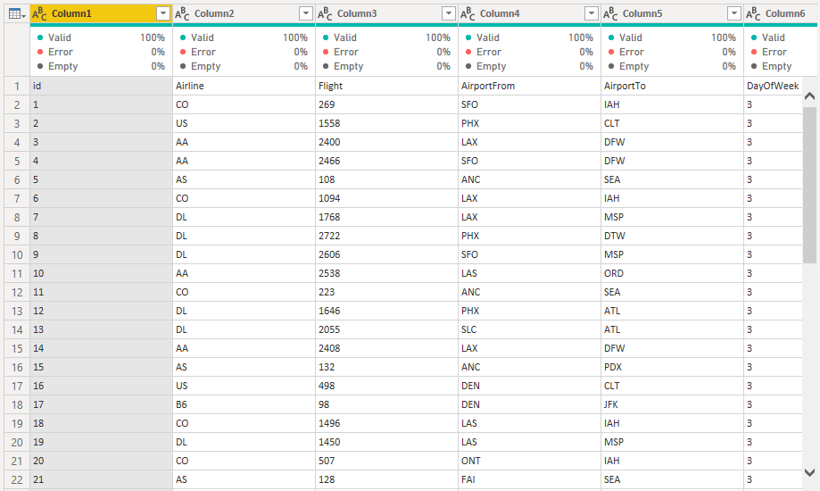

# Project 3 - Airline Delay
* An analysis of flight delay data.
* N.B: this is a summary. Comprehensive report written on this [medium page.](https://medium.com/@seyi_)

## Introduction
The consequences of flight delay can significantly impact airports' on-time performance, airline operations and even passengers. Given the vast amount of data on flight travels, valuable insights can be drawn from this data to allow us gain a better understanding of flight delays. This project therefore presents the analysis driven from flight delay data of different airports and airlines.

## Problem Statement 
The data was originally hosted on Kaggle and was purposed for projecting whether a given flight will be delayed  when given information about scheduled departure. For the purpose of this project, it will just be used to write a story about flight delay experience across the listed airports.
The Federal Aviation Administration(FAA) considers a flight to be delayed when it is 15 minutes later than its scheduled time.

## Basis
Since the project is to provide in-depth analysis of delays and tell a story we would be covering the following:
* Amount of flights delayed;
* Delay by airports and airlines;
* Patterns with delayed flights - time of delays, day of week;
* Possible causes and by how much;
* Recommendations.

## Data Preparation and Exploration
The data file was just downloaded from the 30DL Github repository as it wasn't a continuous dataset that could get updated. It came in the .csv format and was imported into Power BI. At first glance, it looked much like this-

## Data Cleaning and Transformation
From Power BI, it was loaded unto Power Query for transformation. Cleaning started with the first row being made into headers. The column distribution, profile, and quality were checked for irregularities and then information. This helped show that the dataset was fairly clean with no duplicates or empty cells
 

 
 
Columns were formatted with the values of the delay column "1 & 0" replaced with "Yes & No" for ease of understanding, values of the day-of-week column changed from numbers to day format, and others changed to correlate with their corresponding data types.
 

 
 
New columns were created to change the time field into departure time(time values). A new dataset detailing the reason for some delayed flights was also added and transformed with the general cleaning steps with unneeded columns removed. Process is well documented [here.](https://medium.com/@seyi_)
 

## Analysis/Insights
* 44.54% of all flights taken were delayed and this numbered around 240k flights.
* ATL(Hartsfield-Jackson Atlanta International Airport) had 15,000 delays, the highest of any. It was also the busiest airport.
* LAX(Los Angeles International Airport) to SFO(San Francisco International Airport) and its reverse flight were the most made trips with a combined 2156 flights. More than half of the flights were delayed.
* Southwest Airlines(WN) were really affected as they accounted for around 27% of all delays.
* Mornings had less delays compared to other parts of the day.
* Weekdays were busy, with most delays happening on Tuesdays and Thursdays.
* Only 6% of all delays recorded are cauesed by nature.
---

---
## Recommendations
* Airlines such as Southwest(WN) should make sure preventive maintenance for their most flown aircrafts is done very regularly.
* Airlines should optimize and introduce buffers or slack times distributed in an intelligent way across crew schedule.
* Airports and airlines should make increased use of high tech monitoring to run effectively and detect delays. In a case where a fuel truck runs late, it could detect this and recommend parallel boarding(passengers board while refueling).
* Passengers should fly in the morning to avoid delays.
---
Full article on [medium.](https://medium.com/@seyi_)
